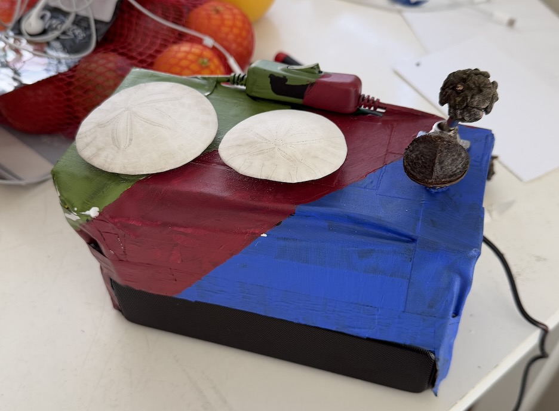

# SomaFM Box

This repo contains code for a dedicated device to stream Music from [SomaFM](http://somafm.com).
This project is not affliated with SomaFM, but gratefully uses their music streaming API.
This repo contains code for a Raspberry Pi to stream music as well as an adruino to monitor a series of dials and switches as the interface.

The controls are:
* Toggle Switch to Toggle the SF Emergency Scanner
* Toggle Switch to Reset 
* Rotary Encoder to set Volume
* Rotary Encoder to set Channel
  
This was just a weekend project, but it/is was a lot of fun I and wanted to share the code for anyone interested in building something similar. Will add more materials should interest develop.

The device contains the following components:
* Raspberry Pi 4
* Arduino Nano
* 2x Rotary Encoders
* 2x Switches
* 1x USB Speaker
* 1x Shoebox (painted)
* A bunch of wires and tape
* 2x Sand Dollars for the dial knobs

The final result is shown below:

